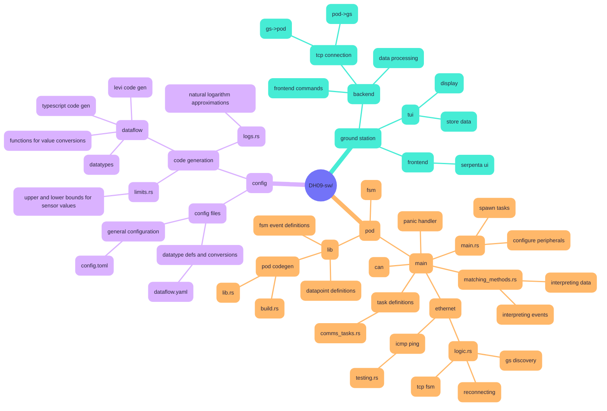

# Delft Hyperloop: Theia (2024 – 2025)

https://www.delfthyperloop.nl/our-pods/theia

Welcome to the brains of Delft Hyperloop 09's pod: _Theia_.
This year, the team focused on joining the move towards hyperloop standardisation,
by scaling up the pod to comply with the track design of the 
[European Hyperloop Centre (EHC)](https://www.hyperloopcenter.eu).

For the second year in a row our code base is (proudly) open-source,
with the hope of inspiring other student teams when developing their hyperloop prototypes,
and to encourage discussion on how these control systems should be built.

# architecture

FAQ:

- where does the name Theia come from?
    - see [https://en.wiktionary.org/wiki/θεία](https://en.wiktionary.org/wiki/θεία)
